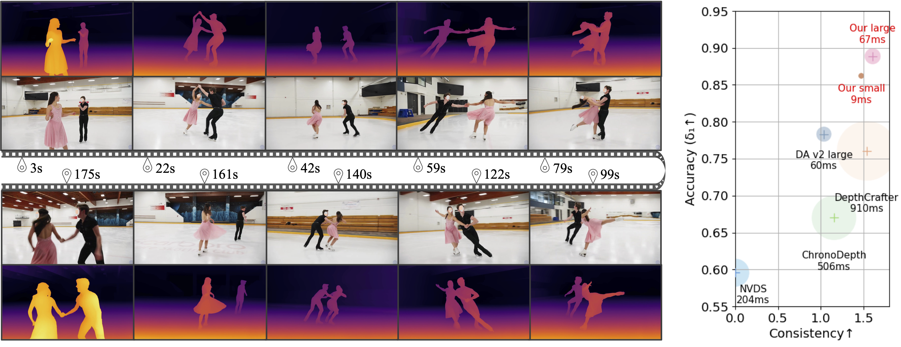

<div align="center">
<h1>Video Depth Anything</h1>
  
[**Sili Chen**](https://github.com/SiliChen321) · [**Hengkai Guo**](https://guohengkai.github.io/)<sup>&dagger;</sup> · [**Shengnan Zhu**](https://github.com/Shengnan-Zhu)  · [**Feihu Zhang**](https://github.com/zhizunhu)
<br>
[**Zilong Huang**](http://speedinghzl.github.io/)   ·  [**Jiashi Feng**](https://scholar.google.com.sg/citations?user=Q8iay0gAAAAJ&hl=en)   ·  [**Bingyi Kang**](https://bingykang.github.io/)<sup>&dagger;</sup> 
<br>
ByteDance
<br>
&dagger;Corresponding author

<a href="https://arxiv.org/abs/2501.12375"></a>
<a href='https://videodepthanything.github.io'></a>
<a href='https://huggingface.co/spaces/depth-anything/Video-Depth-Anything'></a>
</div>

</div>

This work presents **Video Depth Anything** based on [Depth Anything V2](https://github.com/DepthAnything/Depth-Anything-V2), which can be applied to arbitrarily long videos without compromising quality, consistency, or generalization ability. Compared with other diffusion-based models, it enjoys faster inference speed, fewer parameters, and higher consistent depth accuracy.



## News
- **2025-03-11:** Add full dataset inference and evaluation scripts.
- **2025-02-08:** Enable autocast inference. Support grayscale video, NPZ and EXR output formats.
- **2025-01-21:** Paper, project page, code, models, and demo are all released.


## Release Notes
- **2025-02-08:** 🚀🚀🚀 Inference speed and memory usage improvement
  <table>
    <thead>
      <tr>
        <th rowspan="2" style="text-align: center;">Model</th>
        <th colspan="2">Latency (ms)</th>
        <th colspan="2">GPU VRAM (GB)</th>
      </tr>
      <tr>
        <th>FP32</th>
        <th>FP16</th>
        <th>FP32</th>
        <th>FP16</th>
      </tr>
    </thead>
    <tbody>
      <tr>
        <td>Video-Depth-Anything-V2-Small</td>
        <td>9.1</td>
        <td><strong>7.5</strong></td>
        <td>7.3</td>
        <td><strong>6.8</strong></td>
      </tr>
      <tr>
        <td>Video-Depth-Anything-V2-Large</td>
        <td>67</td>
        <td><strong>14</strong></td>
        <td>26.7</td>
        <td><strong>23.6</strong></td>
    </tbody>
  </table>

  The Latency and GPU VRAM results are obtained on a single A100 GPU with input of shape 1 x 32 x 518 × 518.

## Pre-trained Models
We provide **two models** of varying scales for robust and consistent video depth estimation:

| Model | Params | Checkpoint |
|:-|-:|:-:|
| Video-Depth-Anything-V2-Small | 28.4M | [Download](https://huggingface.co/depth-anything/Video-Depth-Anything-Small/resolve/main/video_depth_anything_vits.pth?download=true) |
| Video-Depth-Anything-V2-Large | 381.8M | [Download](https://huggingface.co/depth-anything/Video-Depth-Anything-Large/resolve/main/video_depth_anything_vitl.pth?download=true) |

## Usage

### Preparation

```bash
git clone https://github.com/DepthAnything/Video-Depth-Anything
cd Video-Depth-Anything
pip install -r requirements.txt
```

Download the checkpoints listed [here](#pre-trained-models) and put them under the `checkpoints` directory.
```bash
bash get_weights.sh
```

### Inference a video
```bash
python3 run.py --input_video ./assets/example_videos/davis_rollercoaster.mp4 --output_dir ./outputs --encoder vitl
```

Options:
- `--input_video`: path of input video
- `--output_dir`: path to save the output results
- `--input_size` (optional): By default, we use input size `518` for model inference.
- `--max_res` (optional): By default, we use maximum resolution `1280` for model inference.
- `--encoder` (optional): `vits` for Video-Depth-Anything-V2-Small, `vitl` for Video-Depth-Anything-V2-Large.
- `--max_len` (optional): maximum length of the input video, `-1` means no limit
- `--target_fps` (optional): target fps of the input video, `-1` means the original fps
- `--fp32` (optional): Use `fp32` precision for inference. By default, we use `fp16`.
- `--grayscale` (optional): Save the grayscale depth map, without applying color palette.
- `--save_npz` (optional): Save the depth map in `npz` format.
- `--save_exr` (optional): Save the depth map in `exr` format.

## Citation

If you find this project useful, please consider citing:

```bibtex
@article{video_depth_anything,
  title={Video Depth Anything: Consistent Depth Estimation for Super-Long Videos},
  author={Chen, Sili and Guo, Hengkai and Zhu, Shengnan and Zhang, Feihu and Huang, Zilong and Feng, Jiashi and Kang, Bingyi}
  journal={arXiv:2501.12375},
  year={2025}
}
```


## LICENSE
Video-Depth-Anything-Small model is under the Apache-2.0 license. Video-Depth-Anything-Large model is under the CC-BY-NC-4.0 license. For business cooperation, please send an email to Hengkai Guo at guohengkaighk@gmail.com.
